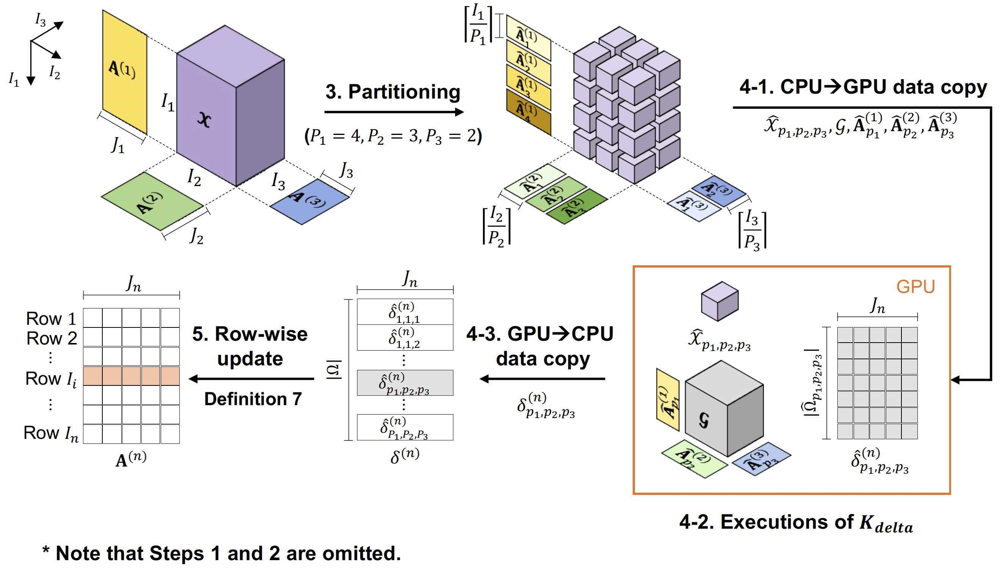
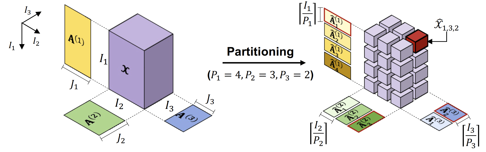
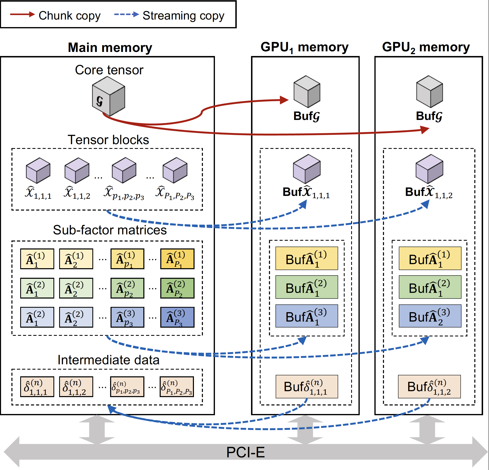
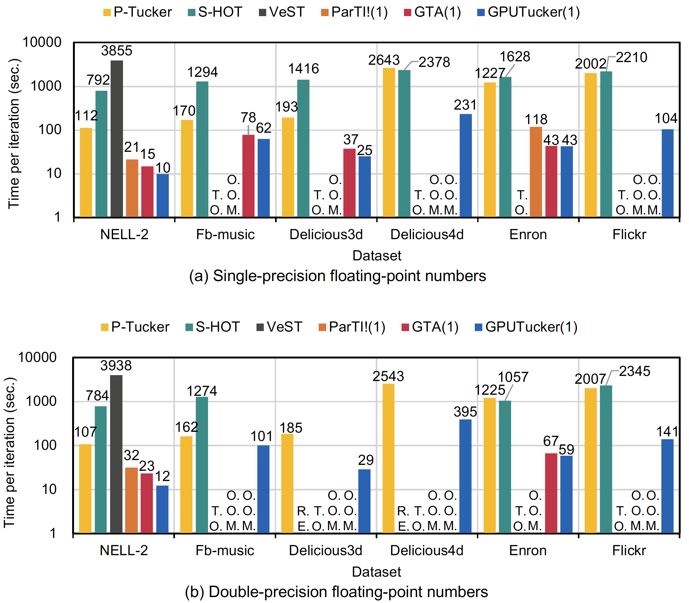

## Overview
### GPUTucker: Large-Scale GPU-Based Tucker Decomposition Using Tensor Partitioning (ESWA 2024)

Tucker decomposition is used extensively for modeling multi-dimensional data represented as tensors. Owing to the increasing magnitude of nonzero values in real-world tensors, a growing demand has emerged for expeditious and scalable Tucker decomposition techniques. Several graphics processing unit (GPU)-accelerated techniques have been proposed for Tucker decomposition to decrease the decomposition speed. However, these approaches often encounter difficulties in handling extensive tensors owing to their huge memory demands, which exceed the available capacity of GPU memory. This study presents an expandable GPU-based technique for Tucker decomposition called GPUTucker. The proposed method meticulously partitions sizable tensors into smaller sub-tensors, which are referred to as tensor blocks, and effectively implements the GPU-based data pipeline by handling these tensor blocks asynchronously. Extensive experiments demonstrate that GPUTucker outperforms state-of-the-art Tucker decomposition methods in terms of the decomposition speed and scalability.


GPUTucker algorithm for updating a factor matrix consists of the following steps.

1. **Initialize values**: GPUTucker initializes all values in the core tensor and all factor matrices with random values between 0 and 1.

2. **Determine the optimal partition parameters**: The optimal number of partitions is determined. By default, this value is set to 1.

3. **Partition the factor matrices**: The factor matrices are partitioned according to the determined partition parameters, resulting in a set of partitioned chunks for each factor matrix.

4. **Compute delta using GPUs**: A GPU-based data pipeline is implemented to compute delta (intermediate data).

   4.1. **Data transfer to GPU**: GPUTucker copies the tensor blocks, core tensor, and partitioned sub-factor matrices into GPU memory.

   4.2. **GPU kernel execution**: The GPU kernel function is invoked to compute the updated delta block.

   4.3. **Data transfer to main memory**: The updated delta block is then copied back to the main memory.

5. **Update factor matrices**: Once all partitioned chunks of the factor matrices have been processed, GPUTucker updates the factor matrices.

Steps 1 through 3 involve setting up the core tensor and factor matrices. Steps 4 and 5 are iterative, with GPUTucker repeating these steps for each tensor block to ensure efficient updates using GPU acceleration. This approach leverages GPU power for faster computation and optimizes memory transfer between the CPU and GPU to minimize overhead.




### Features
#### Dimension partitioning

Efficient partitioning is crucial for optimizing performance in high-dimensional tensor computations. Given an $N$-order tensor $\mathcal{X} \in \mathbb{R}^{I_1 \times I_2 \times \cdots \times I_N}$, GPUTucker implements a robust dimension partitioning strategy. This technique partitions $\mathcal{X}$ into non-overlapping sub-tensors using a set of $N$ parameters $\{P_n \mid 1 \le n \le N\}$.

Each parameter $P_n$ controls the number of partitions along the $I_n$-axis of the input tensor, ensuring optimal division across its dimensions. These partition parameters must adhere to the condition $1 \le P_n \le I_n$, which guarantees that each axis is partitioned within its bounds, preventing over-segmentation or under-utilization of computational resources.

This partitioning approach enhances the parallel processing capabilities of GPUTucker, enabling efficient handling of large-scale tensor operations across multiple computing cores or GPU threads. Users can expect significant improvements in both memory management and computational speed when working with high-dimensional tensors.




#### Efficient GPU Utilization in GPUTucker

GPUTucker is designed to efficiently leverage multiple GPU devices for updating factor matrices using tensor blocks and partitioned factor matrices.

Given the relatively small size of the core tensor (e.g., 0.86 MB for a 3-order tensor when the Tucker rank is 10), GPUTucker replicates the core tensor across both GPU1 and GPU2 to optimize performance. This **core tensor sharing scheme** allows each GPU to operate independently on different tensor blocks.

This approach ensures that the workload is evenly distributed across GPUs, with each GPU processing an almost equal number of tensor blocks, thereby minimizing the risk of workload skewness—a common bottleneck in parallel computing. Additionally, because the computations for different tensor blocks are independent, this scheme scales effectively as more GPU devices are added. This leads to linear performance scale-up when utilizing multiple GPUs, making GPUTucker highly efficient for large-scale tensor computations.




## Installation
### Downloads
The repository can be cloned as follows:
```
git clone https://github.com/DevelopNumericalLibraryForSupercomputer/GPUTucker.git
```
Alternatively, the source files can be downloaded through GitHub 'Download ZIP' option.


### Compile

#### Prerequisites
The following prerequisites are required to compile GPUTucker:
* OpenMP and CUDA (`-lgomp`, `-lcudart`, `-lcublas`)
* Boost library (`-lboost_program_options`, `-lboost_filesystem`, `-lboost_system`)

### Usage

For each application, the folder structure is as follows:
- **include**: Contains all project header files, as well as third-party header files that are not located under `/usr/local/include`.
- **lib**: Contains libraries compiled by the project, including third-party libraries or any others needed during development.
- **source**: Contains the application's source files.

**Input tensors must follow a tab- or space-separated format and use base-1 indexing.**

``````
# Example Tensor
# The tensor is represented as a list of non-zero elements.
# Each row corresponds to an element in the tensor, with the first column representing the indices and the last column representing the value.

# Format: (index 1, index 2, ..., index N) value

1    1    1    4.0
1    2    1    5.5
2    1    1    3.2
2    2    1    2.8
3    2    1    7.3
1    1    2    1.1
1    2    2    6.8
2    1    2    2.9
2    2    2    4.4
...
``````

To run the GPUTucker program, use the following command:

``````
$ ./GPUTucker -i [input_path] -o [order] -r [tucker_rank] -g [num_gpus]
``````


#### Program Options
- **-h** or **--help**: Display the help menu
- **-i** or **--input**: Input tensor path
- **-o** or **--order**: The input tensor order
- **-r** or **--rank**: Tucker rank (default is 10)
- **-g** or **--gpus**: The number of GPUs (default is 1)


## Performance

### Comparison with State-of-the-Art Methods

> **Preconditions:**
> * Tests were conducted in the GPU environment proposed by [Lee et al. (2024)](https://doi.org/10.1016/j.eswa.2023.121445).
> * Dataset details are provided in [Lee et al. (2024)](https://doi.org/10.1016/j.eswa.2023.121445).

* The Tucker rank was set to 10.
* **T.O.:** Indicates a timeout exceeding 12,000 seconds.
* **O.O.M.:** Denotes an out-of-GPU-memory error.
* **R.E.:** Refers to a runtime error.



* GPUTucker outperforms other GPU-based methods, including ParTI! and GTA.
* GPUTucker successfully processed all datasets without encountering O.O.M. errors.
* **Regarding decomposition speed, GPUTucker is faster than P-Tucker, ParTI!, and GTA by factors of 19.25, 2.8, and 1.5, respectively.**

### Scalability of GPUTucker

> **Preconditions:**
> * Tests were conducted in the GPU environment proposed by [Lee et al. (2024)](https://doi.org/10.1016/j.eswa.2023.121445).
> * Dataset details are provided in [Lee et al. (2024)](https://doi.org/10.1016/j.eswa.2023.121445).


* GPUTucker demonstrated a near-linear reduction in runtime as the number of GPUs increased across all datasets.
* This improvement was particularly noticeable with large factor matrices (i.e., $J_n = 30$), which significantly increased the computational workload.


## Example code

### Code
```cpp

#include <iostream>

#include "gputucker/cmdline_opts.hpp"
#include "gputucker/helper.hpp"
#include "gputucker/tensor.hpp"
#include "gputucker/tensor_manager.hpp"
#include "gputucker/tucker.cuh"

int main(int argc, char *argv[]) {
  using namespace supertensor::gputucker;

  // Parse command line options
  // The program begins by parsing command-line options, 
  // such as the input tensor file, tensor order, Tucker rank, and the number of GPUs to use.
  // These options are critical for configuring the GPUTucker algorithm.
  CommandLineOptions *options = new CommandLineOptions;
  CommandLineOptions::ReturnStatus ret = options->Parse(argc, argv);

  if (CommandLineOptions::OPTS_SUCCESS == ret) {
    // Input file
    std::cout << options->get_input_path() << std::endl;

    using index_t = uint32_t;
    using value_t = double;
    using block_t = Block<index_t, value_t>;
    using tensor_t = Tensor<block_t>;

    bool is_double = std::is_same<value_t, double>::value;
    if (is_double) {
      printf("Values are double type.\n");
    } else {
      printf("Values are float type.\n");
    }

    // Read tensor from file
    tensor_t *input_tensor = new tensor_t(options->get_order());
    ParseFromFile<tensor_t>(options->get_input_path(), &input_tensor);

    // Perform Tucker decomposition
    TuckerDecomposition<tensor_t>(input_tensor, options->get_rank(), options->get_gpu_count());

  } else {
    std::cout << "ERROR - problem with options." << std::endl;
  }

  return 0;
}
```


### Authors
* **Jihye Lee** (jh_lee@dgist.ac.kr) - Department of Electrical Engineering and Computer Science, Daegu Gyeongbuk Institute of Science and Technology (DGIST)
* **Donghyoung Han** (dhhan@graphai.io) - GraphAI
* **Oh-Kyoung Kwon** (okkwon@kisti.re.kr) - National Institute of Supercomputing and Networking, Korea Institute of Science and Technology Information (KISTI)
* **Kang-Wook Chon** (kw.chon@koreatech.ac.kr) - School of Computer Science and Engineering, Korea University of Technology and Education
* **Min-Soo Kim** (minsoo.k@kaist.ac.kr) - School of Computing, Korea Advanced Institute of Science and Technology (KAIST)

### Citation

If you refer to this project, please use the following BibTeX entry:

```bibtex
@article{LEE2024121445,
title = {GPUTucker: Large-Scale GPU-Based Tucker Decomposition Using Tensor Partitioning},
journal = {Expert Systems with Applications},
volume = {237},
pages = {121445},
year = {2024},
issn = {0957-4174},
doi = {https://doi.org/10.1016/j.eswa.2023.121445},
url = {https://www.sciencedirect.com/science/article/pii/S0957417423019474},
author = {Jihye Lee and Donghyoung Han and Oh-Kyoung Kwon and Kang-Wook Chon and Min-Soo Kim}
}
```
